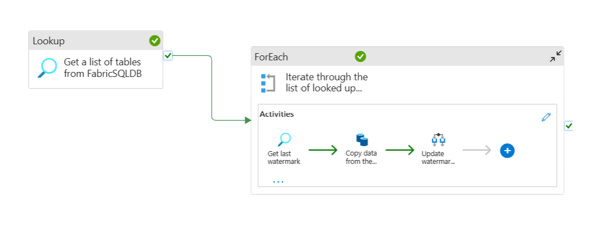

# Azure Data Factory CI/CD Pipeline with Metadata-Driven Incremental Loads

## 📘 Overview

This repository demonstrates a robust CI/CD pipeline setup for Azure Data Factory (ADF), leveraging metadata-driven design for full and incremental data loads. It includes environment-based deployment using Azure DevOps and dynamic pipeline configuration that supports both `datetime` and `int` watermarking strategies.

## 🗂 Project Structure

```bash
.
├── assets/
│   ├── pipeline_overview.png
│   ├── foreach_details.png
├── data-factory/
│   ├── pipelines/
│   ├── factory/
│   ├── datasets/
│   └── linkedServices/
├── devops/
│   ├── adf-build-job.yml
│   ├── adf-deploy-job.yml
├── package.json
├── azure-pipelines.yml
└── README.md
```

## 🚀 CI/CD Pipeline Flow

### Triggers

```yaml
trigger:
  branches:
    include:
      - main

pr:
  branches:
    include:
      - main
```

Only the `main` branch is allowed to trigger deployments. Feature branches (e.g., `feature/*`) do not trigger the pipeline.

### Stages

#### `BUILD`

- Exports ADF ARM templates

#### `DEV`

- Deploys artifacts to **Development** environment
- Uses pipeline parameters and the `DEV` variable group

#### `PROD`

- Triggered only when changes are merged into `main`
- Uses condition:

  ```yaml
  condition: and(succeeded(), eq(variables['Build.SourceBranch'], 'refs/heads/main'))
  ```

## 🔁 Metadata-Driven Incremental Loads

### Metadata Table

```sql
CREATE TABLE dbo.ETL_Table_Metadata (
  table_name NVARCHAR(100),
  schema_name NVARCHAR(50),
  is_incremental BIT,
  watermark_column NVARCHAR(100),
  watermark_type NVARCHAR(20),
  last_loaded_datetime DATETIME,
  last_loaded_integer INT
);
```

### Lookup Query (to fetch metadata)

```sql
SELECT 
    t.TABLE_NAME AS tableName,
    t.TABLE_SCHEMA AS schemaName,
    COALESCE(m.is_incremental, 0) AS isIncremental,
    COALESCE(m.watermark_column, '') AS watermarkColumn,
    COALESCE(m.last_loaded_datetime, '2000-01-01') AS lastLoadedDate,
    COALESCE(m.last_loaded_integer, 0) AS lastLoadedItem,
    m.watermark_type AS watermarkType
FROM INFORMATION_SCHEMA.TABLES t
LEFT JOIN dbo.ETL_Table_Metadata m
    ON t.TABLE_NAME = m.table_name
WHERE t.TABLE_SCHEMA = 'dbo' AND t.TABLE_NAME NOT IN ('ETL_Table_Metadata')
```

### Runtime SQL for Copy Activity

```expression
@{if(
  and(equals(item().isIncremental, 1), not(empty(activity('Get last watermark').output.firstRow.watermarkType))),
  if(
    equals(activity('Get last watermark').output.firstRow.watermarkType, 'int'),
    concat(
      'SELECT * FROM ', item().schemaName, '.', item().tableName,
      ' WHERE ', item().watermarkColumn, ' > ',
      activity('Get last watermark').output.firstRow.last_loaded_integer
    ),
    concat(
      'SELECT * FROM ', item().schemaName, '.', item().tableName,
      ' WHERE ', item().watermarkColumn, ' > ''',
      activity('Get last watermark').output.firstRow.last_loaded_datetime, ''''
    )
  ),
  concat('SELECT * FROM ', item().schemaName, '.', item().tableName)
)}
```

### Stored Procedure for Watermark Update

```sql
CREATE PROCEDURE [dbo].[usp_UpdateWatermark]
    @tableName NVARCHAR(255),
    @newWatermark NVARCHAR(50),
    @watermarkType NVARCHAR(20)
AS
BEGIN
    IF @watermarkType = 'datetime'
    BEGIN
        UPDATE dbo.ETL_Table_Metadata
        SET last_loaded_datetime = CONVERT(DATETIME, @newWatermark)
        WHERE table_name = @tableName;
    END
    ELSE
    BEGIN
        UPDATE dbo.ETL_Table_Metadata
        SET last_loaded_integer = CONVERT(INT, @newWatermark)
        WHERE table_name = @tableName;
    END
END;
```

## 🖼 Pipeline Design Overview

Below is the visual flow of the metadata-driven pipeline in Azure Data Factory.

### 🔄 Top-Level Flow: Lookup > ForEach



### 🧠 ForEach: Get Watermark, Copy, Update

Inside the ForEach, the pipeline dynamically:

- Retrieves the last watermark
- Gets the new max watermark
- Performs conditional data copy
- Conditionally updates watermark via stored procedure


## 📦 Blob Output & File Naming Convention

- Partitioned output folder path:

```expression
@concat(
  dataset().serverName, '/',
  dataset().databaseName, '/',
  dataset().tableName,
  '/Year=', formatDateTime(utcNow(), 'yyyy'),
  '/Month=', formatDateTime(utcNow(), 'MM'),
  '/Day=', formatDateTime(utcNow(), 'dd')
)
```

- File name format:

```expression
@concat(dataset().schemaName, '_',dataset().tableName, '_', formatDateTime(utcNow(), 'yyyyMMddHHmmss'), '.parquet')
```

## 🧠 Parameterization Strategy

- Pipeline-level parameters feed into dataset parameters
- Dataset parameters cascade into linked service parameters
- This enables full dynamic configuration at runtime without hardcoding values

## 🛡 Branch Protection Strategy

Configure via Azure DevOps under `Repos → Branches → Policies` on `main` branch:

- Require PR approvals
- Prevent direct pushes
- Require successful build validation before merging

## 👨‍💻 Author

**Tunde Morakinyo**  
*BI Developer & Azure Data Platform Engineer*

---

Feel free to fork, clone, or extend this setup in your projects. Contributions welcome!
